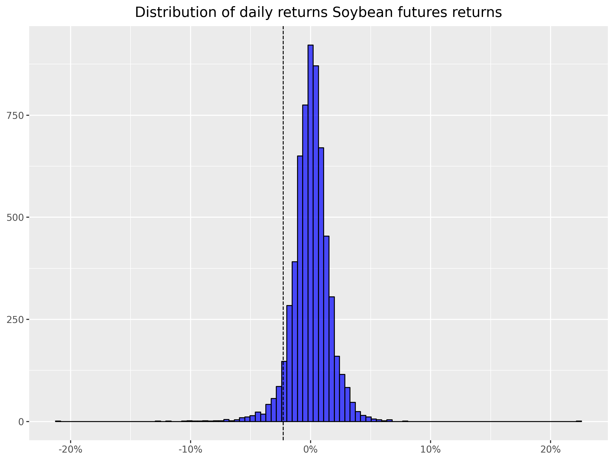
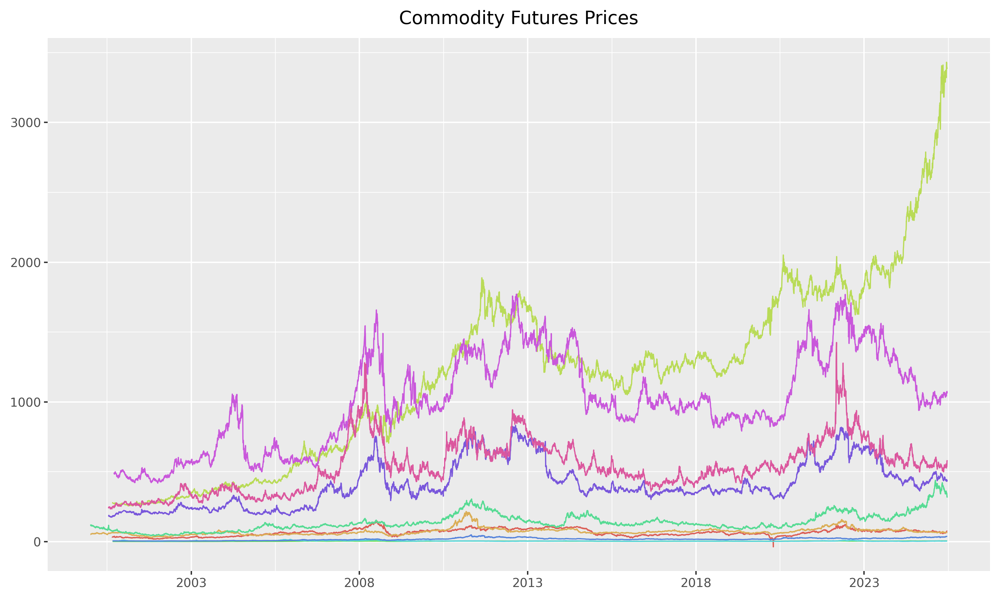
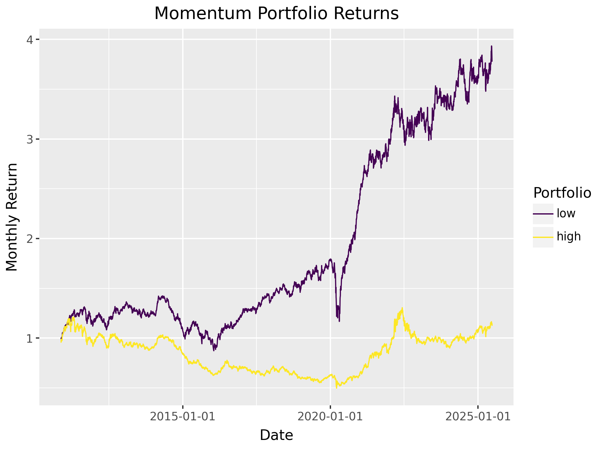
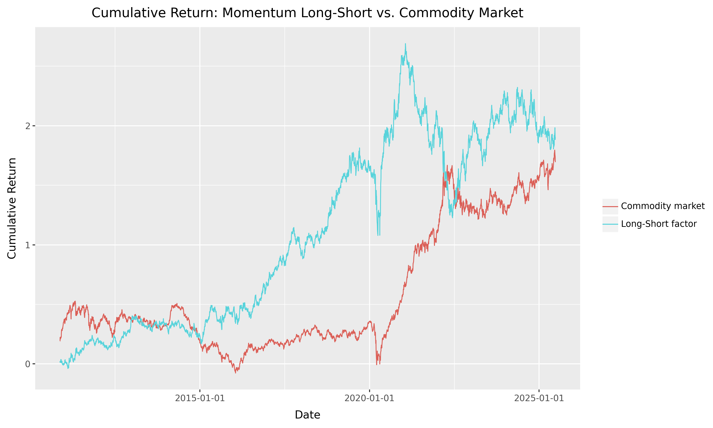

# Factor investing in commodities

When using `yfinance` for commodity futures, we observe only the **front-month futures prices**, typically rolled automatically.

This allows us to construct:

- **Excess returns** on fully collateralized long futures positions.
- **Momentum** from rolling 12-month returns.
- **Average Commodity Factor** as the equal-weighted return across contracts.

However, we cannot construct basis-related factors:

- **Basis** requires both front- and second-nearby prices.
- **Basis-Momentum** needs the term structure slope over time.

Thus, our pricing tests will focus on factors we can construct reliably with `yfinance`.


## Commodity Futures


Yahoo Finance provides daily prices of nearest futures contracts, specifically what they call **continuous front-month futures** for commodities (e.h., `CL=F` for WTI Crude Oil). These are automatically rolled contracts and do not represent a specific maturity date.

In this section, we will download and process commodity futures data using the `yfinance` library and convert it to a Polars DataFrame. We will then save the data in Parquet format for further analysis.

```python 
import yfinance as yf
import polars as pl

# Define commodity futures tickers
tickers = {
    # Energy
    "WTI Crude Oil": "CL=F",
    "Brent Crude Oil": "BZ=F",
    "Gasoline RBOB": "RB=F",
    "Heating Oil": "HO=F",
    "Natural Gas": "NG=F",
    "Propane": "PG=F",  # approximate or rarely available
    # Gasoil is not available directly on Yahoo Finance

    # Grains & Oilseeds
    "Corn": "ZC=F",
    "Wheat": "ZW=F",
    "Soybeans": "ZS=F",
    "Soybean Meal": "ZM=F",
    "Soybean Oil": "ZL=F",
    "Oats": "ZO=F",
    # Canola is traded on ICE Canada, not reliably on Yahoo

    # Livestock
    "Live Cattle": "LE=F",
    "Feeder Cattle": "GF=F",
    "Lean Hogs": "HE=F",
    # Pork Belly: contract discontinued

    # Metals
    "Gold": "GC=F",
    "Silver": "SI=F",
    "Copper": "HG=F",
    "Platinum": "PL=F",
    "Palladium": "PA=F",
    # LME metals (Aluminum, Zinc, Nickel, etc.) are not on Yahoo Finance

    # Softs
    "Coffee": "KC=F",
    "Cocoa": "CC=F",
    "Cotton": "CT=F",
    "Sugar": "SB=F",
    "Orange Juice": "OJ=F",
    "Lumber": "LB=F",
    # Rubber is TOCOM, not on Yahoo
    # Ethanol and Milk may not have reliable tickers on Yahoo

    # Others
    "Ethanol": "EH=F",  # may exist, but not always available
    "Skim Milk": "DA=F",  # Approximate dairy futures ticker
}


# Download monthly data
df = yf.download(list(tickers.values()), start="2000-01-01", interval="1d", auto_adjust=False)
df = df.stack(level=1).reset_index()  # Convert from wide to long format

# Convert to Polars DataFrame
pl_df = pl.from_pandas(df)

# Rename columns to lowercase and consistent names
pl_df = pl_df.rename({
    "Date": "date",
    "Ticker": "symbol",
    "Adj Close": "adjusted_close",
    "Close": "close",
    "Open": "open",
    "High": "high",
    "Low": "low",
    "Volume": "volume"
})

# Reorder columns
pl_df = pl_df.select(["date", "symbol", "volume", "open", "low", "high", "close", "adjusted_close"]
                     ).filter(pl.col("adjusted_close") > 0)

print(pl_df.head())

pl_df.write_parquet("commodity_futures.parquet")
```

```bash 
shape: (5, 8)
┌─────┬─────┬─────┬─────┬─────┬─────┬─────┬───────┐
│ dat ┆ sym ┆ vol ┆ ope ┆ low ┆ hig ┆ clo ┆ adjus │
│ e   ┆ bol ┆ ume ┆ n   ┆ --- ┆ h   ┆ se  ┆ ted_c │
│ --- ┆ --- ┆ --- ┆ --- ┆ f64 ┆ --- ┆ --- ┆ lose  │
│ dat ┆ str ┆ f64 ┆ f64 ┆     ┆ f64 ┆ f64 ┆ ---   │
│ eti ┆     ┆     ┆     ┆     ┆     ┆     ┆ f64   │
│ me[ ┆     ┆     ┆     ┆     ┆     ┆     ┆       │
│ ns] ┆     ┆     ┆     ┆     ┆     ┆     ┆       │
╞═════╪═════╪═════╪═════╪═════╪═════╪═════╪═══════╡
│ 200 ┆ CT= ┆ 803 ┆ 50. ┆ 50. ┆ 51. ┆ 51. ┆ 51.07 │
│ 0-0 ┆ F   ┆ 3.0 ┆ 43  ┆ 349 ┆ 099 ┆ 07  ┆       │
│ 1-0 ┆     ┆     ┆     ┆ 998 ┆ 998 ┆     ┆       │
│ 3   ┆     ┆     ┆     ┆     ┆     ┆     ┆       │
│ 00: ┆     ┆     ┆     ┆     ┆     ┆     ┆       │
│ 00: ┆     ┆     ┆     ┆     ┆     ┆     ┆       │
│ 00  ┆     ┆     ┆     ┆     ┆     ┆     ┆       │
│ 200 ┆ KC= ┆ 664 ┆ 124 ┆ 116 ┆ 124 ┆ 116 ┆ 116.5 │
│ 0-0 ┆ F   ┆ 0.0 ┆ .0  ┆ .09 ┆ .0  ┆ .5  ┆       │
│ 1-0 ┆     ┆     ┆     ┆ 999 ┆     ┆     ┆       │
│ 3   ┆     ┆     ┆     ┆ 8   ┆     ┆     ┆       │
│ 00: ┆     ┆     ┆     ┆     ┆     ┆     ┆       │
│ 00: ┆     ┆     ┆     ┆     ┆     ┆     ┆       │
│ 00  ┆     ┆     ┆     ┆     ┆     ┆     ┆       │
│ 200 ┆ CT= ┆ 470 ┆ 50. ┆ 50. ┆ 50. ┆ 50. ┆ 50.73 │
│ 0-0 ┆ F   ┆ 9.0 ┆ 900 ┆ 25  ┆ 970 ┆ 73  ┆       │
│ 1-0 ┆     ┆     ┆ 002 ┆     ┆ 001 ┆     ┆       │
│ 4   ┆     ┆     ┆     ┆     ┆     ┆     ┆       │
│ 00: ┆     ┆     ┆     ┆     ┆     ┆     ┆       │
│ 00: ┆     ┆     ┆     ┆     ┆     ┆     ┆       │
│ 00  ┆     ┆     ┆     ┆     ┆     ┆     ┆       │
│ 200 ┆ KC= ┆ 549 ┆ 116 ┆ 115 ┆ 120 ┆ 116 ┆ 116.2 │
│ 0-0 ┆ F   ┆ 2.0 ┆ .5  ┆ .75 ┆ .5  ┆ .25 ┆ 5     │
│ 1-0 ┆     ┆     ┆     ┆     ┆     ┆     ┆       │
│ 4   ┆     ┆     ┆     ┆     ┆     ┆     ┆       │
│ 00: ┆     ┆     ┆     ┆     ┆     ┆     ┆       │
│ 00: ┆     ┆     ┆     ┆     ┆     ┆     ┆       │
│ 00  ┆     ┆     ┆     ┆     ┆     ┆     ┆       │
│ 200 ┆ CT= ┆ 104 ┆ 50. ┆ 50. ┆ 51. ┆ 51. ┆ 51.56 │
│ 0-0 ┆ F   ┆ 64. ┆ 75  ┆ 75  ┆ 84  ┆ 560 ┆ 0001  │
│ 1-0 ┆     ┆ 0   ┆     ┆     ┆     ┆ 001 ┆       │
│ 5   ┆     ┆     ┆     ┆     ┆     ┆     ┆       │
│ 00: ┆     ┆     ┆     ┆     ┆     ┆     ┆       │
│ 00: ┆     ┆     ┆     ┆     ┆     ┆     ┆       │
│ 00  ┆     ┆     ┆     ┆     ┆     ┆     ┆       │
└─────┴─────┴─────┴─────┴─────┴─────┴─────┴───────┘
```

Next, we use the `plotnine` library to visualize the soybean futures prices.

```python
from plotnine import *
import pandas as pd
import polars as pl


soybean_price = (
    pl.read_parquet("commodity_futures.parquet").filter(pl.col("symbol") == "ZS=F").to_pandas()
)

soybean_prices_figure = (
    ggplot(soybean_price, aes(x="date", y="adjusted_close")) +
    geom_line(color="blue") +
    labs(title="Soybean Futures Prices", x="Date", y="Adjusted Close Price")
)

soybean_prices_figure.show()

soybeans_returns_figure.save("../../docs/docs/images/priced_factors/soybeans_returns_distribution.png", dpi=300, width=8, height=6)
```


We can now calculate the daily returns for each commodity futures contract. The following code snippet demonstrates how to compute the percentage change in the adjusted close prices and save the results in a new Parquet file.

```python
import polars as pl

data = pl.read_parquet("commodity_futures.parquet")


returns = (
    data
    .sort(["symbol", "date"])
    .group_by("symbol")
    .map_groups(
        lambda df: df.select([
            pl.col("date"),
            pl.col("symbol"),
            pl.col("adjusted_close").pct_change().alias("ret")
        ])
    )
    .filter(pl.col("ret").is_not_null())
)

print(returns.head())

returns.write_parquet("commodity_futures_returns.parquet")
```

```bash
shape: (5, 3)
┌─────────────────────┬────────┬───────────┐      
│ date                ┆ symbol ┆ ret       │       
│ ---                 ┆ ---    ┆ ---       │       
│ datetime[ns]        ┆ str    ┆ f64       │       
╞═════════════════════╪════════╪═══════════╡       
│ 2000-08-24 00:00:00 ┆ CL=F   ┆ -0.013105 │       
│ 2000-08-25 00:00:00 ┆ CL=F   ┆ 0.013279  │       
│ 2000-08-28 00:00:00 ┆ CL=F   ┆ 0.025585  │       
│ 2000-08-29 00:00:00 ┆ CL=F   ┆ -0.004563 │       
│ 2000-08-30 00:00:00 ┆ CL=F   ┆ 0.020782  │       
└─────────────────────┴────────┴───────────┘ 
```

Now, we can visualize the distribution of daily returns for soybean futures using the `plotnine` library. The following code snippet creates a histogram of the returns and saves it as an image file.

```python
import polars as pl
import pandas as pd
from plotnine import *
from mizani.formatters import percent_format

returns = (pl.read_parquet("commodity_futures_returns.parquet")
        .filter(
            # soybeans
            pl.col("symbol") == "ZS=F"
        )
        .to_pandas()
)

quantile_05 = returns["ret"].quantile(0.05)

soybeans_returns_figure = (
      ggplot(returns, aes(x="ret"))
  + geom_histogram(bins=100, fill="blue", color="black", alpha=0.7)
  + geom_vline(aes(xintercept=quantile_05), linetype="dashed")
  + labs(x="", y="", title="Distribution of daily returns Soybean futures returns")
  + scale_x_continuous(labels=percent_format())
)

soybeans_returns_figure.save("soybeans_returns_distribution.png", dpi=300, width=8, height=6)

# Display the figure
soybeans_returns_figure.show()
```




We can also compute the descriptive statistics of the daily returns for all commodity futures. The following code snippet reads the returns data from the Parquet file and calculates the descriptive statistics, rounding the results to three decimal places.

```python	
import polars as pl 

returns = (pl.read_parquet("commodity_futures_returns.parquet")
)

desc = returns.select("ret").describe()
print(desc.with_columns(
    pl.col("ret").round(3)
))
```

```bash
shape: (9, 2)
┌────────────┬─────────┐
│ statistic  ┆ ret     │
│ ---        ┆ ---     │
│ str        ┆ f64     │
╞════════════╪═════════╡
│ count      ┆ 62607.0 │
│ null_count ┆ 0.0     │
│ mean       ┆ 0.0     │
│ std        ┆ 0.025   │
│ min        ┆ -3.06   │
│ 25%        ┆ -0.01   │
│ 50%        ┆ 0.0     │
│ 75%        ┆ 0.01    │
│ max        ┆ 0.465   │
└────────────┴─────────┘
```

Finally, we can visualize the commodity futures prices over time using the `plotnine` library. The following code snippet creates a line plot of the adjusted close prices for all commodities and saves it as an image file.

```python
from plotnine import *
import pandas as pd
import polars as pl


prices = (
    pl.read_parquet("commodity_futures.parquet").to_pandas()
)

from mizani.breaks import date_breaks
from mizani.formatters import date_format

prices_figure = (
  ggplot(prices, aes(y="adjusted_close", x="date", color="symbol"))
  + geom_line()
  + scale_x_datetime(date_breaks="5 years", date_labels="%Y")
  + labs(x="", y="", color="", title="Commodity Futures Prices")
  + theme(legend_position="none")
)
prices_figure.show()

prices_figure.save("../../docs/docs/images/priced_factors/commodity_futures_prices.png", dpi=300, width=10, height=6)
```




## Commodity Factor Portfolios

To form the commodity factor portfolios, we rely on the simple portfolio sort. The idea is simple. On one date:

1. Rank commodities according to a particular criterion (e.g., past returns).
2. form \\(J \geq 2\\) portfolios (i.e., homogenous groups) consisting on the same number of stocks according to the ranking (usually \\(J=2\\), \\(J=3\\), \\(J=5\\) or \\(J=10\\) portfolios are built, based on the median, terciles, quintiles or deciles of the criterion);
3. the weight of stocks inside the portfolio is uniform in our case.
4. at a future date \\(t+1\\), report the returns of the portfolios. Then iterate the procedure until the chronological end of the sample.

The outcome is a time series of portfolio returns \\(r^j_t\\) for each portfolio \\(j\\) and time \\(t\\). An anomaly is identified if the \\(t\\)-test between the first \\(j=1\\) and the last group \\(j=J\\) unveils a significant difference in average returns. 


We first construct the momentum characteristic, which is the cumulative return of the past 11 months (excluding the most recent month). This is done by calculating the cumulative product of \\(1 + r_t\\) for the past 11 months.

```python
import pandas as pd
import numpy as np
import statsmodels.api as sm
from regtabletotext import prettify_result


LOW_Q, HIGH_Q = 0.01, 0.99        # 1-percent winsorisation tails

# ── 1. Load panel of excess returns ────────────────────────────────────
# expected columns: date (yyy-mm-dd), ticker, ret  (monthly excess return in decimal form)
raw = (
    pd.read_parquet("commodity_futures_returns.parquet")
    .query("date >= '2010-01-01'")  # filter for dates if needed
)


# 2. Winsorise returns cross-sectionally each month
def winsorise_month(df: pd.DataFrame) -> pd.DataFrame:
    """Clip ret to [1st, 99th] percentile for this month’s cross section."""
    lo = df["ret"].quantile(LOW_Q)
    hi = df["ret"].quantile(HIGH_Q)
    return df.assign(ret=df["ret"].clip(lower=lo, upper=hi))

wins = (
    raw
      .assign(date=lambda d: pd.to_datetime(d["date"]))
      .groupby("date")
      .apply(winsorise_month)
      .reset_index(drop=True)
)

# ── 2. Momentum: cumulative product of (1+ret) for the past 11 months ────────
# but we have in daily data, so we need to adjust the window
# to account for the number of trading days in a month (typically around 20-22
# trading days per month).
# Here we use a window of 11 months, which is approximately 220 trading days.
def add_momentum(df: pd.DataFrame, window: int = 220) -> pd.DataFrame:
    """
    Add a 'momentum' column: cumulative return from t-12 to t-2
    (skip the most-recent month, hence shift(1)).
    """
    # Ensure date column is datetime and properly sorted
    df = df.assign(date=pd.to_datetime(df["date"])).sort_values("date")
    
    # Rolling cumulative return = Π(1+ret) − 1
    df["momentum"] = (
        df["ret"]
        .shift(1)                                     # skip last month
        .rolling(window=window, min_periods=window)   # t-12 … t-2 (11 obs)
        .apply(lambda x: (1 + x).prod() - 1, raw=True)
    )
    return df

panel = (
    wins
    .groupby("symbol")  # keep original index
    .apply(add_momentum)
    .reset_index(drop=True)
    .dropna(subset=["momentum"])  # drop rows where momentum is NaN
)
```

We will rebalance the portfolios monthly, using the momentum characteristic to sort the commodities into quantiles. The following code snippet demonstrates how to create the portfolios based on momentum and calculate their returns.


```python
panel["rebalance_date"] = panel["date"].dt.to_period("M").dt.to_timestamp()


# ── 4. Month-by-month portfolio formation ──────────────────────────────
#     and equal-weight (mean) portfolio returns
n_port = 3                                       # quintiles (change as desired)

rebalancing_universe = (
    panel
    .drop_duplicates(subset=["symbol", "rebalance_date"])  # one row per symbol per month
    .groupby("rebalance_date")
    .apply(lambda x: x.assign(
        portfolio=pd.qcut(x["momentum"], q=[0, 0.5, 1], labels=["low", "high"])
    ))
    .reset_index(drop=True)
    .dropna(subset=["portfolio"])
    .get(["symbol", "rebalance_date", "portfolio"])
)

# Merge daily panel with monthly portfolio assignment
panel_with_portfolio = (
    panel
    .merge(rebalancing_universe, on=["symbol", "rebalance_date"], how="left")
    .dropna(subset=["portfolio"])  # drop rows before first assignment
)


daily_portfolio_returns = (
    panel_with_portfolio
    .groupby(["date", "portfolio"], as_index=False)
    .agg(ret=("ret", "mean"))  # equal-weight return
)

cumulative_rets = (
    daily_portfolio_returns.sort_values(["portfolio", "date"])  # sort by portfolio and date
      .groupby("portfolio")          # one time-series per portfolio
      .apply(lambda df: df.assign(
          cumulative_ret=(1 + df["ret"]).cumprod() # running product minus 1
      ))
      .reset_index(drop=True)
)

cumulative_rets.to_csv("cumulative_momentum_portfolios.csv", index=False)

from plotnine import * 

# ── 5. Plotting the portfolio returns ───────────────────────────────────
plot = (
    ggplot(cumulative_rets, aes(x="date", y="cumulative_ret", color="portfolio")) +
    geom_line() +
    labs(title="Momentum Portfolio Returns",
         x="Date",
         y="Monthly Return",
         color="Portfolio")
)

plot.show()

```

Interestingly, the low momentum portfolio seems to outperform the high momentum portfolio, which is contrary to the typical expectation in momentum strategies. 




Based on the previous insights, we construct a **reversal portfolio** by taking the difference between the low and high momentum portfolios. In other words, we create a long-short portfolio that goes long on the low momentum portfolio and short on the high momentum portfolio.

```python

long_short = (daily_portfolio_returns
  .pivot_table(index="date", columns="portfolio", values="ret")
  .reset_index()
  .assign(long_short=lambda x: x["low"]-x["high"])
)


cum_long_short = (
    long_short
    .assign(cumulative_long_short=lambda x: (1 + x["long_short"]).cumprod() - 1)
)

# plot long short returns
plot_ls = (
    ggplot(cum_long_short, aes(x="date", y="cumulative_long_short")) +
    geom_line(color="blue") +
    labs(title="Cumulative Long-Short Momentum Returns",
         x="Date",
         y="Cumulative Return")
)

plot_ls.show()
```


We now compare the cumulative returns of the long-short reversal portfolio with the equal-weighted market portfolio. The market portfolio is constructed by averaging the daily returns of all commodities, which gives us a benchmark to assess the performance of our reversal strategy.

```python

# ────────────────────────────────────────────────────────────────────────
# 1.  Equal-weight “market” portfolio (all contracts each day)  🚩
# ────────────────────────────────────────────────────────────────────────
market_daily = (
    wins                       # winsorised daily returns you already created
      .groupby("date", as_index=False)
      .agg(mkt_ret=("ret", "mean"))   # simple equal-weight
)

# cumulative market return
market_cum = (
    market_daily
      .assign(cumulative_mkt=lambda d: (1 + d["mkt_ret"]).cumprod() - 1)
      .get(["date", "cumulative_mkt"])
)


# ────────────────────────────────────────────────────────────────────────
# 2.  Combine long-short and market series for plotting  🚩
# ────────────────────────────────────────────────────────────────────────
plot_df = (
    cum_long_short[["date", "cumulative_long_short"]]
      .merge(market_cum, on="date", how="inner")
      .melt(id_vars="date", var_name="series", value_name="cum_ret")
      .replace({
          "cumulative_long_short": "Long-Short factor",
          "cumulative_mkt": "Commodity market"
      })
)

plot_both = (
    ggplot(plot_df, aes(x="date", y="cum_ret", color="series")) +
    geom_line() +
    labs(
        title="Cumulative Return: Momentum Long-Short vs. Commodity Market",
        x="Date", y="Cumulative Return",
        color=""
    )
)

plot_both.show()
```




We can finally test the significance of the long-short portfolio returns using a t-test. This will help us determine if the average returns of the long-short portfolio are significantly different from zero.

```python
import statsmodels.api as sm
from regtabletotext import prettify_result


model_fit = (sm.OLS.from_formula(
    formula="long_short ~ 1",
    data=long_short
  )
  .fit(cov_type="HAC", cov_kwds={"maxlags": 6})
)
prettify_result(model_fit)
```

```bash
OLS Model:
long_short ~ 1

Coefficients:
           Estimate  Std. Error  t-Statistic  p-Value
Intercept       0.0         0.0         2.17     0.03

Summary statistics:
- Number of observations: 3,672
- R-squared: 0.000, Adjusted R-squared: 0.000
- F-statistic not available
```

Since p = 0.03 < 0.05, we can reject the null of zero mean at the 5 % level. This means that the average return of the long-short reversal portfolio is statistically significant, indicating that the strategy has a positive expected return over the sample period.
