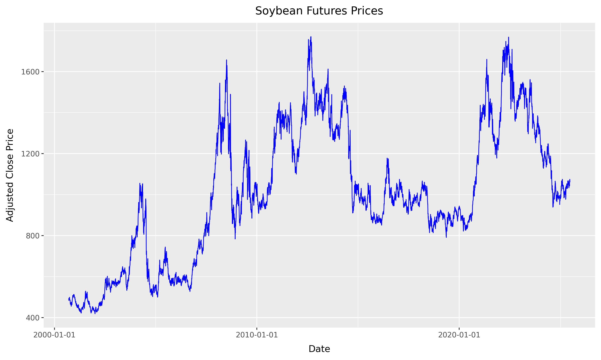

# Factor investing in commodities

When using `yfinance` for commodity futures, we observe only the **front-month futures prices**, typically rolled automatically.

This allows us to construct:

- **Excess returns** on fully collateralized long futures positions.
- **Momentum** from rolling 12-month returns.
- **Average Commodity Factor** as the equal-weighted return across contracts.

However, we cannot construct basis-related factors:

- **Basis** requires both front- and second-nearby prices.
- **Basis-Momentum** needs the term structure slope over time.

Thus, our pricing tests will focus on factors we can construct reliably with `yfinance`.


## Commodity Futures


### Futures Data from Yahoo Finance

Yahoo Finance provides daily prices of nearest futures contracts, specifically what they call **continuous front-month futures** for commodities (e.h., `CL=F` for WTI Crude Oil). These are automatically rolled contracts and do not represent a specific maturity date.

In this section, we will download and process commodity futures data using the `yfinance` library and convert it to a Polars DataFrame. We will then save the data in Parquet format for further analysis.

```python 
import yfinance as yf
import polars as pl

# Define commodity futures tickers
tickers = {
    "WTI Crude Oil": "CL=F",
    "Gold": "GC=F",
    "Corn": "ZC=F",
    "Wheat": "ZW=F",
    "Soybeans": "ZS=F",
    "Silver": "SI=F",
    "Copper": "HG=F",
    "Natural Gas": "NG=F",
    "Coffee": "KC=F",
    "Cotton": "CT=F"
}

# Download monthly data
df = yf.download(list(tickers.values()), start="2000-01-01", interval="1d", auto_adjust=False)
df = df.stack(level=1).reset_index()  # Convert from wide to long format

# Convert to Polars DataFrame
pl_df = pl.from_pandas(df)

# Rename columns to lowercase and consistent names
pl_df = pl_df.rename({
    "Date": "date",
    "Ticker": "symbol",
    "Adj Close": "adjusted_close",
    "Close": "close",
    "Open": "open",
    "High": "high",
    "Low": "low",
    "Volume": "volume"
})

# Reorder columns
pl_df = pl_df.select(["date", "symbol", "volume", "open", "low", "high", "close", "adjusted_close"])

print(pl_df.head())

pl_df.write_parquet("commodity_futures.parquet")
```

```bash 
shape: (5, 8)
┌─────┬─────┬─────┬─────┬─────┬─────┬─────┬───────┐
│ dat ┆ sym ┆ vol ┆ ope ┆ low ┆ hig ┆ clo ┆ adjus │
│ e   ┆ bol ┆ ume ┆ n   ┆ --- ┆ h   ┆ se  ┆ ted_c │
│ --- ┆ --- ┆ --- ┆ --- ┆ f64 ┆ --- ┆ --- ┆ lose  │
│ dat ┆ str ┆ f64 ┆ f64 ┆     ┆ f64 ┆ f64 ┆ ---   │
│ eti ┆     ┆     ┆     ┆     ┆     ┆     ┆ f64   │
│ me[ ┆     ┆     ┆     ┆     ┆     ┆     ┆       │
│ ns] ┆     ┆     ┆     ┆     ┆     ┆     ┆       │
╞═════╪═════╪═════╪═════╪═════╪═════╪═════╪═══════╡
│ 200 ┆ CT= ┆ 803 ┆ 50. ┆ 50. ┆ 51. ┆ 51. ┆ 51.07 │
│ 0-0 ┆ F   ┆ 3.0 ┆ 43  ┆ 349 ┆ 099 ┆ 07  ┆       │
│ 1-0 ┆     ┆     ┆     ┆ 998 ┆ 998 ┆     ┆       │
│ 3   ┆     ┆     ┆     ┆     ┆     ┆     ┆       │
│ 00: ┆     ┆     ┆     ┆     ┆     ┆     ┆       │
│ 00: ┆     ┆     ┆     ┆     ┆     ┆     ┆       │
│ 00  ┆     ┆     ┆     ┆     ┆     ┆     ┆       │
│ 200 ┆ KC= ┆ 664 ┆ 124 ┆ 116 ┆ 124 ┆ 116 ┆ 116.5 │
│ 0-0 ┆ F   ┆ 0.0 ┆ .0  ┆ .09 ┆ .0  ┆ .5  ┆       │
│ 1-0 ┆     ┆     ┆     ┆ 999 ┆     ┆     ┆       │
│ 3   ┆     ┆     ┆     ┆ 8   ┆     ┆     ┆       │
│ 00: ┆     ┆     ┆     ┆     ┆     ┆     ┆       │
│ 00: ┆     ┆     ┆     ┆     ┆     ┆     ┆       │
│ 00  ┆     ┆     ┆     ┆     ┆     ┆     ┆       │
│ 200 ┆ CT= ┆ 470 ┆ 50. ┆ 50. ┆ 50. ┆ 50. ┆ 50.73 │
│ 0-0 ┆ F   ┆ 9.0 ┆ 900 ┆ 25  ┆ 970 ┆ 73  ┆       │
│ 1-0 ┆     ┆     ┆ 002 ┆     ┆ 001 ┆     ┆       │
│ 4   ┆     ┆     ┆     ┆     ┆     ┆     ┆       │
│ 00: ┆     ┆     ┆     ┆     ┆     ┆     ┆       │
│ 00: ┆     ┆     ┆     ┆     ┆     ┆     ┆       │
│ 00  ┆     ┆     ┆     ┆     ┆     ┆     ┆       │
│ 200 ┆ KC= ┆ 549 ┆ 116 ┆ 115 ┆ 120 ┆ 116 ┆ 116.2 │
│ 0-0 ┆ F   ┆ 2.0 ┆ .5  ┆ .75 ┆ .5  ┆ .25 ┆ 5     │
│ 1-0 ┆     ┆     ┆     ┆     ┆     ┆     ┆       │
│ 4   ┆     ┆     ┆     ┆     ┆     ┆     ┆       │
│ 00: ┆     ┆     ┆     ┆     ┆     ┆     ┆       │
│ 00: ┆     ┆     ┆     ┆     ┆     ┆     ┆       │
│ 00  ┆     ┆     ┆     ┆     ┆     ┆     ┆       │
│ 200 ┆ CT= ┆ 104 ┆ 50. ┆ 50. ┆ 51. ┆ 51. ┆ 51.56 │
│ 0-0 ┆ F   ┆ 64. ┆ 75  ┆ 75  ┆ 84  ┆ 560 ┆ 0001  │
│ 1-0 ┆     ┆ 0   ┆     ┆     ┆     ┆ 001 ┆       │
│ 5   ┆     ┆     ┆     ┆     ┆     ┆     ┆       │
│ 00: ┆     ┆     ┆     ┆     ┆     ┆     ┆       │
│ 00: ┆     ┆     ┆     ┆     ┆     ┆     ┆       │
│ 00  ┆     ┆     ┆     ┆     ┆     ┆     ┆       │
└─────┴─────┴─────┴─────┴─────┴─────┴─────┴───────┘
```

Next, we use the `plotnine` library to visualize the soybean futures prices.

```python
from plotnine import *
import pandas as pd
import polars as pl


soybean_price = (
    pl.read_parquet("commodity_futures.parquet").filter(pl.col("symbol") == "ZS=F").to_pandas()
)

soybean_prices_figure = (
    ggplot(soybean_price, aes(x="date", y="adjusted_close")) +
    geom_line(color="blue") +
    labs(title="Soybean Futures Prices", x="Date", y="Adjusted Close Price")
)

soybean_prices_figure.show()

soybeans_returns_figure.save("../../docs/docs/images/priced_factors/soybeans_returns_distribution.png", dpi=300, width=8, height=6)
```




### Calculating Daily Returns

We can now calculate the daily returns for each commodity futures contract. The following code snippet demonstrates how to compute the percentage change in the adjusted close prices and save the results in a new Parquet file.

```python
import polars as pl

data = pl.read_parquet("commodity_futures.parquet")


returns = (
    data
    .sort(["symbol", "date"])
    .group_by("symbol")
    .map_groups(
        lambda df: df.select([
            pl.col("date"),
            pl.col("symbol"),
            pl.col("adjusted_close").pct_change().alias("ret")
        ])
    )
    .filter(pl.col("ret").is_not_null())
)

print(returns.head())

returns.write_parquet("commodity_futures_returns.parquet")
```

```bash
shape: (5, 3)
┌─────────────────────┬────────┬───────────┐       
│ date                ┆ symbol ┆ ret       │       
│ ---                 ┆ ---    ┆ ---       │       
│ datetime[ns]        ┆ str    ┆ f64       │       
╞═════════════════════╪════════╪═══════════╡       
│ 2000-08-24 00:00:00 ┆ CL=F   ┆ -0.013105 │       
│ 2000-08-25 00:00:00 ┆ CL=F   ┆ 0.013279  │       
│ 2000-08-28 00:00:00 ┆ CL=F   ┆ 0.025585  │       
│ 2000-08-29 00:00:00 ┆ CL=F   ┆ -0.004563 │       
│ 2000-08-30 00:00:00 ┆ CL=F   ┆ 0.020782  │       
└─────────────────────┴────────┴───────────┘ 
```

Now, we can visualize the distribution of daily returns for soybean futures using the `plotnine` library. The following code snippet creates a histogram of the returns and saves it as an image file.

```python
import polars as pl
import pandas as pd
from plotnine import *
from mizani.formatters import percent_format

returns = (pl.read_parquet("commodity_futures_returns.parquet")
        .filter(
            # soybeans
            pl.col("symbol") == "ZS=F"
        )
        .to_pandas()
)

quantile_05 = returns["ret"].quantile(0.05)

soybeans_returns_figure = (
      ggplot(returns, aes(x="ret"))
  + geom_histogram(bins=100, fill="blue", color="black", alpha=0.7)
  + geom_vline(aes(xintercept=quantile_05), linetype="dashed")
  + labs(x="", y="", title="Distribution of daily returns Soybean futures returns")
  + scale_x_continuous(labels=percent_format())
)

soybeans_returns_figure.save("soybeans_returns_distribution.png", dpi=300, width=8, height=6)

# Display the figure
soybeans_returns_figure.show()
```


We can also compute the descriptive statistics of the daily returns for all commodity futures. The following code snippet reads the returns data from the Parquet file and calculates the descriptive statistics, rounding the results to three decimal places.

```python	
import polars as pl 

returns = (pl.read_parquet("commodity_futures_returns.parquet")
)

desc = returns.select("ret").describe()
print(desc.with_columns(
    pl.col("ret").round(3)
))
```

```bash
shape: (9, 2)
┌────────────┬─────────┐
│ statistic  ┆ ret     │
│ ---        ┆ ---     │
│ str        ┆ f64     │
╞════════════╪═════════╡
│ count      ┆ 62607.0 │
│ null_count ┆ 0.0     │
│ mean       ┆ 0.0     │
│ std        ┆ 0.025   │
│ min        ┆ -3.06   │
│ 25%        ┆ -0.01   │
│ 50%        ┆ 0.0     │
│ 75%        ┆ 0.01    │
│ max        ┆ 0.465   │
└────────────┴─────────┘
```

Finally, we can visualize the commodity futures prices over time using the `plotnine` library. The following code snippet creates a line plot of the adjusted close prices for all commodities and saves it as an image file.

```python
from plotnine import *
import pandas as pd
import polars as pl


prices = (
    pl.read_parquet("commodity_futures.parquet").to_pandas()
)

from mizani.breaks import date_breaks
from mizani.formatters import date_format

prices_figure = (
  ggplot(prices, aes(y="adjusted_close", x="date", color="symbol"))
  + geom_line()
  + scale_x_datetime(date_breaks="5 years", date_labels="%Y")
  + labs(x="", y="", color="", title="Commodity Futures Prices")
  + theme(legend_position="none")
)
prices_figure.show()

prices_figure.save("../../docs/docs/images/priced_factors/commodity_futures_prices.png", dpi=300, width=10, height=6)
```


## Commodity Factor Portfolios

To form the commodity factor portfolios, we rely on the simple portfolio sort. The idea is simple. On one date:

1. Rank commodities according to a particular criterion (e.g., past returns).
2. form \\(J \geq 2\\) portfolios (i.e., homogenous groups) consisting on the same number of stocks according to the ranking (usually \\(J=2\\), \\(J=3\\), \\(J=5\\) or \\(J=10\\) portfolios are built, based on the median, terciles, quintiles or deciles of the criterion);
3. the weight of stocks inside the portfolio is uniform in our case.
4. at a future date \\(t+1\\), report the returns of the portfolios. Then iterate the procedure until the chronological end of the sample.

The outcome is a time series of portfolio returns \\(r^j_t\\) for each portfolio \\(j\\) and time \\(t\\). An anomaly is identified if the \\(t\\)-test between the first \\(j=1\\) and the last group \\(j=J\\) unveils a significant difference in average returns. 


