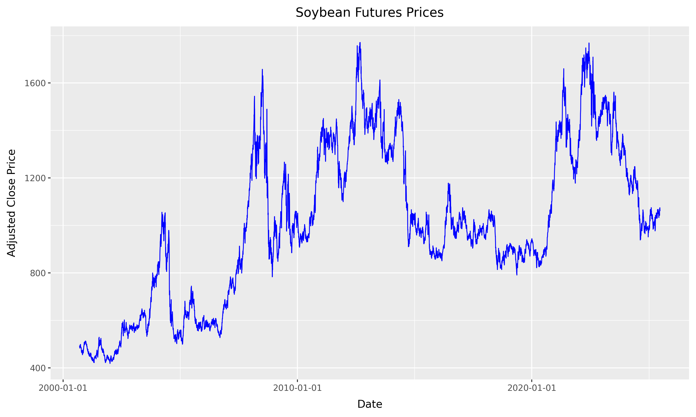
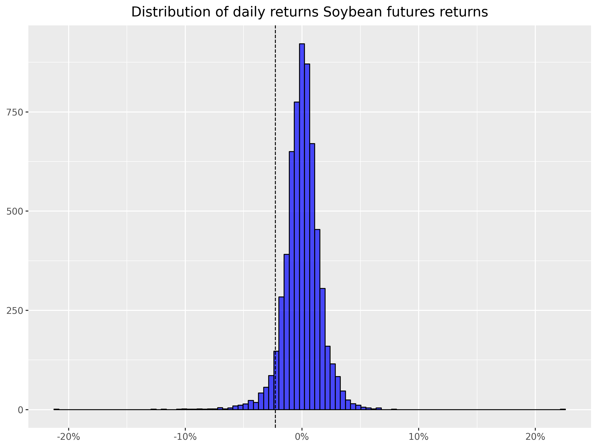

# Which Commodity Factors are Priced?

- Present the empirical evidence (e.G. 4-factor model)

- Describe the role of:
    - Average Commodity Factor
    - Basis
    - Momentum
    - Basis-Momentum

## Data and variables


### 🛢️ Energy
| Commodity           | Exchange | Ticker |
|---------------------|----------|--------|
| Brent Crude Oil     | ICE      | CO     |
| Gasoil Petroleum    | ICE      | QS     |
| Gasoline            | NYMEX    | HU/XB  |
| Heating Oil         | NYMEX    | HO     |
| Natural Gas         | NYMEX    | NG     |
| Propane             | NYMEX    | PN     |
| WTI Crude Oil       | NYMEX    | CL     |

### 🌾 Grains & Oilseeds
| Commodity         | Exchange | Ticker |
|-------------------|----------|--------|
| Canola            | WCE      | RC     |
| Corn              | CBOT     | C-     |
| Oats              | CBOT     | O-     |
| Rough Rice        | CBOT     | RR     |
| Soybean Meal      | CBOT     | SM     |
| Soybean Oil       | CBOT     | BO     |
| Soybeans          | CBOT     | S-     |
| Wheat             | CBOT     | W      |

### 🐄 Livestock
| Commodity       | Exchange | Ticker |
|-----------------|----------|--------|
| Feeder Cattle   | CME      | FC     |
| Lean Hogs       | CME      | LH     |
| Live Cattle     | CME      | LC     |
| Pork Belly      | CME      | PB     |

### 🪙 Metals
| Commodity     | Exchange | Ticker |
|---------------|----------|--------|
| Aluminum      | LME      | LA     |
| Copper        | NYMEX    | HG     |
| Gold          | NYMEX    | GC     |
| Lead          | LME      | LL     |
| Nickel        | LME      | LN     |
| Palladium     | NYMEX    | PA     |
| Platinum      | NYMEX    | PL     |
| Silver        | NYMEX    | SI     |
| Tin           | LME      | LT     |
| Zinc          | LME      | LX     |

### 🍫 Softs
| Commodity       | Exchange | Ticker |
|-----------------|----------|--------|
| Cocoa           | ICE      | CC     |
| Coffee          | ICE      | KC     |
| Cotton          | ICE      | CT     |
| Ethanol         | CME      | DL     |
| Lumber          | CME      | LB     |
| Milk            | CME      | DE     |
| Orange Juice    | ICE      | JO     |
| Rubber          | TOCOM    | YR     |
| Sugar           | ICE      | SB     |


### Commodity futures data


In this section, we will download and process commodity futures data using the `yfinance` library and convert it to a Polars DataFrame. We will then save the data in Parquet format for further analysis.

```python 
import yfinance as yf
import polars as pl

# Define commodity futures tickers
tickers = {
    "WTI Crude Oil": "CL=F",
    "Gold": "GC=F",
    "Corn": "ZC=F",
    "Wheat": "ZW=F",
    "Soybeans": "ZS=F",
    "Silver": "SI=F",
    "Copper": "HG=F",
    "Natural Gas": "NG=F",
    "Coffee": "KC=F",
    "Cotton": "CT=F"
}

# Download monthly data
df = yf.download(list(tickers.values()), start="2000-01-01", interval="1d", auto_adjust=False)
df = df.stack(level=1).reset_index()  # Convert from wide to long format

# Convert to Polars DataFrame
pl_df = pl.from_pandas(df)

# Rename columns to lowercase and consistent names
pl_df = pl_df.rename({
    "Date": "date",
    "Ticker": "symbol",
    "Adj Close": "adjusted_close",
    "Close": "close",
    "Open": "open",
    "High": "high",
    "Low": "low",
    "Volume": "volume"
})

# Reorder columns
pl_df = pl_df.select(["date", "symbol", "volume", "open", "low", "high", "close", "adjusted_close"])

print(pl_df.head())

pl_df.write_parquet("commodity_futures.parquet")
```

```bash 
shape: (5, 8)
┌─────┬─────┬─────┬─────┬─────┬─────┬─────┬───────┐
│ dat ┆ sym ┆ vol ┆ ope ┆ low ┆ hig ┆ clo ┆ adjus │
│ e   ┆ bol ┆ ume ┆ n   ┆ --- ┆ h   ┆ se  ┆ ted_c │
│ --- ┆ --- ┆ --- ┆ --- ┆ f64 ┆ --- ┆ --- ┆ lose  │
│ dat ┆ str ┆ f64 ┆ f64 ┆     ┆ f64 ┆ f64 ┆ ---   │
│ eti ┆     ┆     ┆     ┆     ┆     ┆     ┆ f64   │
│ me[ ┆     ┆     ┆     ┆     ┆     ┆     ┆       │
│ ns] ┆     ┆     ┆     ┆     ┆     ┆     ┆       │
╞═════╪═════╪═════╪═════╪═════╪═════╪═════╪═══════╡
│ 200 ┆ CT= ┆ 803 ┆ 50. ┆ 50. ┆ 51. ┆ 51. ┆ 51.07 │
│ 0-0 ┆ F   ┆ 3.0 ┆ 43  ┆ 349 ┆ 099 ┆ 07  ┆       │
│ 1-0 ┆     ┆     ┆     ┆ 998 ┆ 998 ┆     ┆       │
│ 3   ┆     ┆     ┆     ┆     ┆     ┆     ┆       │
│ 00: ┆     ┆     ┆     ┆     ┆     ┆     ┆       │
│ 00: ┆     ┆     ┆     ┆     ┆     ┆     ┆       │
│ 00  ┆     ┆     ┆     ┆     ┆     ┆     ┆       │
│ 200 ┆ KC= ┆ 664 ┆ 124 ┆ 116 ┆ 124 ┆ 116 ┆ 116.5 │
│ 0-0 ┆ F   ┆ 0.0 ┆ .0  ┆ .09 ┆ .0  ┆ .5  ┆       │
│ 1-0 ┆     ┆     ┆     ┆ 999 ┆     ┆     ┆       │
│ 3   ┆     ┆     ┆     ┆ 8   ┆     ┆     ┆       │
│ 00: ┆     ┆     ┆     ┆     ┆     ┆     ┆       │
│ 00: ┆     ┆     ┆     ┆     ┆     ┆     ┆       │
│ 00  ┆     ┆     ┆     ┆     ┆     ┆     ┆       │
│ 200 ┆ CT= ┆ 470 ┆ 50. ┆ 50. ┆ 50. ┆ 50. ┆ 50.73 │
│ 0-0 ┆ F   ┆ 9.0 ┆ 900 ┆ 25  ┆ 970 ┆ 73  ┆       │
│ 1-0 ┆     ┆     ┆ 002 ┆     ┆ 001 ┆     ┆       │
│ 4   ┆     ┆     ┆     ┆     ┆     ┆     ┆       │
│ 00: ┆     ┆     ┆     ┆     ┆     ┆     ┆       │
│ 00: ┆     ┆     ┆     ┆     ┆     ┆     ┆       │
│ 00  ┆     ┆     ┆     ┆     ┆     ┆     ┆       │
│ 200 ┆ KC= ┆ 549 ┆ 116 ┆ 115 ┆ 120 ┆ 116 ┆ 116.2 │
│ 0-0 ┆ F   ┆ 2.0 ┆ .5  ┆ .75 ┆ .5  ┆ .25 ┆ 5     │
│ 1-0 ┆     ┆     ┆     ┆     ┆     ┆     ┆       │
│ 4   ┆     ┆     ┆     ┆     ┆     ┆     ┆       │
│ 00: ┆     ┆     ┆     ┆     ┆     ┆     ┆       │
│ 00: ┆     ┆     ┆     ┆     ┆     ┆     ┆       │
│ 00  ┆     ┆     ┆     ┆     ┆     ┆     ┆       │
│ 200 ┆ CT= ┆ 104 ┆ 50. ┆ 50. ┆ 51. ┆ 51. ┆ 51.56 │
│ 0-0 ┆ F   ┆ 64. ┆ 75  ┆ 75  ┆ 84  ┆ 560 ┆ 0001  │
│ 1-0 ┆     ┆ 0   ┆     ┆     ┆     ┆ 001 ┆       │
│ 5   ┆     ┆     ┆     ┆     ┆     ┆     ┆       │
│ 00: ┆     ┆     ┆     ┆     ┆     ┆     ┆       │
│ 00: ┆     ┆     ┆     ┆     ┆     ┆     ┆       │
│ 00  ┆     ┆     ┆     ┆     ┆     ┆     ┆       │
└─────┴─────┴─────┴─────┴─────┴─────┴─────┴───────┘
```

Next, we use the `plotnine` library to visualize the soybean futures prices.

```python
from plotnine import *
import pandas as pd
import polars as pl


soybean_price = (
    pl.read_parquet("commodity_futures.parquet").filter(pl.col("symbol") == "ZS=F").to_pandas()
)

soybean_prices_figure = (
    ggplot(soybean_price, aes(x="date", y="adjusted_close")) +
    geom_line(color="blue") +
    labs(title="Soybean Futures Prices", x="Date", y="Adjusted Close Price")
)

soybean_prices_figure.show()

soybeans_returns_figure.save("../../docs/docs/images/priced_factors/soybeans_returns_distribution.png", dpi=300, width=8, height=6)
```




We can now calculate the daily returns for each commodity futures contract. The following code snippet demonstrates how to compute the percentage change in the adjusted close prices and save the results in a new Parquet file.

```python
import polars as pl

data = pl.read_parquet("commodity_futures.parquet")


returns = (
    data
    .sort(["symbol", "date"])
    .group_by("symbol")
    .map_groups(
        lambda df: df.select([
            pl.col("date"),
            pl.col("symbol"),
            pl.col("adjusted_close").pct_change().alias("ret")
        ])
    )
    .filter(pl.col("ret").is_not_null())
)

print(returns.head())

returns.write_parquet("commodity_futures_returns.parquet")
```

```bash
shape: (5, 3)
┌─────────────────────┬────────┬───────────┐       
│ date                ┆ symbol ┆ ret       │       
│ ---                 ┆ ---    ┆ ---       │       
│ datetime[ns]        ┆ str    ┆ f64       │       
╞═════════════════════╪════════╪═══════════╡       
│ 2000-08-24 00:00:00 ┆ CL=F   ┆ -0.013105 │       
│ 2000-08-25 00:00:00 ┆ CL=F   ┆ 0.013279  │       
│ 2000-08-28 00:00:00 ┆ CL=F   ┆ 0.025585  │       
│ 2000-08-29 00:00:00 ┆ CL=F   ┆ -0.004563 │       
│ 2000-08-30 00:00:00 ┆ CL=F   ┆ 0.020782  │       
└─────────────────────┴────────┴───────────┘ 
```

Now, we can visualize the distribution of daily returns for soybean futures using the `plotnine` library. The following code snippet creates a histogram of the returns and saves it as an image file.

```python
import polars as pl
import pandas as pd
from plotnine import *
from mizani.formatters import percent_format

returns = (pl.read_parquet("commodity_futures_returns.parquet")
        .filter(
            # soybeans
            pl.col("symbol") == "ZS=F"
        )
        .to_pandas()
)

quantile_05 = returns["ret"].quantile(0.05)

soybeans_returns_figure = (
      ggplot(returns, aes(x="ret"))
  + geom_histogram(bins=100, fill="blue", color="black", alpha=0.7)
  + geom_vline(aes(xintercept=quantile_05), linetype="dashed")
  + labs(x="", y="", title="Distribution of daily returns Soybean futures returns")
  + scale_x_continuous(labels=percent_format())
)

soybeans_returns_figure.save("soybeans_returns_distribution.png", dpi=300, width=8, height=6)

# Display the figure
soybeans_returns_figure.show()
```




We can also compute the descriptive statistics of the daily returns for all commodity futures. The following code snippet reads the returns data from the Parquet file and calculates the descriptive statistics, rounding the results to three decimal places.

```python	
import polars as pl 

returns = (pl.read_parquet("commodity_futures_returns.parquet")
)

desc = returns.select("ret").describe()
print(desc.with_columns(
    pl.col("ret").round(3)
))
```

```bash
shape: (9, 2)
┌────────────┬─────────┐
│ statistic  ┆ ret     │
│ ---        ┆ ---     │
│ str        ┆ f64     │
╞════════════╪═════════╡
│ count      ┆ 62607.0 │
│ null_count ┆ 0.0     │
│ mean       ┆ 0.0     │
│ std        ┆ 0.025   │
│ min        ┆ -3.06   │
│ 25%        ┆ -0.01   │
│ 50%        ┆ 0.0     │
│ 75%        ┆ 0.01    │
│ max        ┆ 0.465   │
└────────────┴─────────┘
```

Finally, we can visualize the commodity futures prices over time using the `plotnine` library. The following code snippet creates a line plot of the adjusted close prices for all commodities and saves it as an image file.

```python
from plotnine import *
import pandas as pd
import polars as pl


prices = (
    pl.read_parquet("commodity_futures.parquet").to_pandas()
)

from mizani.breaks import date_breaks
from mizani.formatters import date_format

prices_figure = (
  ggplot(prices, aes(y="adjusted_close", x="date", color="symbol"))
  + geom_line()
  + scale_x_datetime(date_breaks="5 years", date_labels="%Y")
  + labs(x="", y="", color="", title="Commodity Futures Prices")
  + theme(legend_position="none")
)
prices_figure.show()

prices_figure.save("../../docs/docs/images/priced_factors/commodity_futures_prices.png", dpi=300, width=10, height=6)
```


### Characteristics of Commodity Futures


### Commodity Factor Portfolios


## Performance of Commodity Portfolios 


## Choosing Priced Commodity Factors

### The Harvey and Liu (2019) Approach

### Spanning Tests
